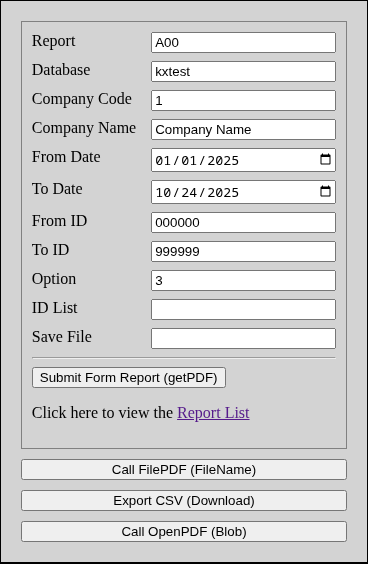
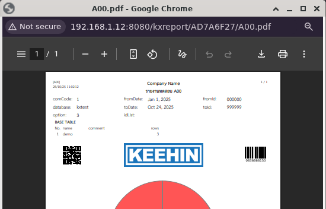
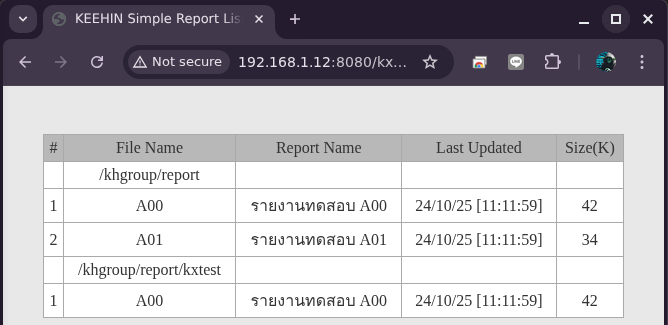

# KxReport


## 📘 Introduction

**KXReport** is a Spring Boot application designed as a dedicated **Report Generator Service** for the local **KEEHIN Application**. It specializes in generating dynamic reports using **JasperReports 7** and exposes this functionality via **RESTful API endpoints**.

---

## 🧩 Software Requirements

| Server       | Version |
| ------------ | ------- |
| Java Runtime | >= 17   |
| Tomcat       | >= 10   |
| MariaDB      | >= 10   |

---

| Developer    | Version |
| ------------ | ------- |
| Java JDK     | >= 17   |
| Git, Github  | 2.39.5  |
| Maven        | 3.8.7   |
| JasperReport | 7.x     |

---

## 🌐 Services on Server

The application is deployed as a WAR file (`kxreport.war`) and accessible at the following base URL:

```url
http://host:8080/kxreport
http://host:8080/kxreport/list.html
```

See all **parameters** and request demo from index.html<br>
<br>
<br>
See detail of report folder from list.html<br>
<br>

## ⚙️ API Endpoints

| Method   | Path       | Produces           | Description                                                                  |
| -------- | ---------- | ------------------ | ---------------------------------------------------------------------------- |
| **GET**  | `/json`    | `application/json` | Retrieves a list of all Jasper reports (`.jasper` files) details             |
| **GET**  | `/getPDF`  | `application/pdf`  | Generates JasperReport to PDF response, parameters in query requests.        |
| **POST** | `/openPDF` | `application/pdf`  | Generates JasperReport to PDF response, parameters in body request           |
| **POST** | `/filePDF` | `text/plain`       | Generates JasperReport to PDF file name response, parameters in body request |
| **POST** | `/fileCSV` | `text/plain`       | Generates JasperReport to CSV file name response, parameters in body request |

---

## 🛠️ Installation

### Clone repository

```bash
git clone https://github.com/swasin185/kxreport
cd kxreport
```

### ./script/install.sh

Software requirement on Server

```bash
#!/bin/bash
apt install default-jdk-headless git maven mariadb-server tomcat10
mysql < ./sql/init-db.sql
```

### [./script/build.sh](./script/build.sh)

First time build all kxreport then update library and make report folder

---

### Folder Structure

You should put \*.jasper file under ./report/
root of folder mean default app is ""
and support all database if not exists any report in sub database folder

```text
/khgroup/report/
|── app1/
|   |── database1/
|   |   └── *.jasper
|   |── database2/
|       └── *.jasper
|── app2/
|   |── database1/
|   |   └── *.jasper
|   |── database2/
|       └── *.jasper
|── database1/
|   └── *.jasper
|── *.jasper
```

---

## For Developer

### Jaspersoft Studio 7.0.3

Community Edition is recommended for developing and editing .jrxml templates.

```url
https://community.jaspersoft.com/download-jaspersoft/community-edition
```

Font Configuration: Ensure THSarabun font are configured (Thai Language):

- add THSarabun fonts in ./fonts/
- OR add classpath to ./src/main/webapps/WEB-INF/lib/jasperreports-fonts.jar

## Docker Script

Docker for evaluation or testing See ./script/docker/\*.sh.
Docker environment use the newer version of Java, Tomcat, MariaDB.
Update on late 2025 it support by Java v25, Tomcat v11, MariaDB v12

### ./script/docker/docker.sh

```bash
#!/bin/bash
docker pull maven:3.9-eclipse-temurin-25-alpine
docker pull mariadb:12-noble
docker pull tomcat:11-jre25
./docker-stop.sh
./docker-mvn.sh
./docker-mariadb.sh
./docker-tomcat.sh
```

---

## SSL Host Service

```url
https://host:8443/kxreport
https://host:8443/kxreport/list.html
```

- Generate SSL certificate from ./script/cert/genkey.sh

```bash
cd ./script/cert
./genkey.sh
cd ../..
```

- You can should one of 2 ways to setup SSL Nginx or TomcatSSL

### Nginx (Reverse Proxy)

- Set Nginx to SSL 8443 reverse proxy to Tomcat http://localhost:8080/kxreport
  Nginx configuration file is in ./script/nginx/kxreport.conf

```bash
sudo apt install nginx

# Setup Nginx
sudo cp ./script/nginx/kxreport.conf /etc/nginx/sites-available/
sudo ln -s /etc/nginx/sites-available/kxreport.conf /etc/nginx/sites-enabled/
sudo systemctl restart nginx

# Block all external traffic to your backend ports
sudo ufw deny 8080/tcp
sudo ufw deny 3000/tcp

# Ensure only the NGINX port is open to the world
sudo ufw allow 8443/tcp
```

### Tomcat (SSL)

```bash
TOMCAT="tomcat10"
TOMCAT_LIB_DIR="/var/lib/${TOMCAT}/conf"
sudo cp ./script/cert/server.xml "${TOMCAT_LIB_DIR}/server.xml"
```

## application.properties

if you want to modify database connection user/password or report folder you can
edit ./src/main/resources/application.properties

```bash
logging.level.root = INFO
logging.file.name = /var/lib/tomcat10/logs/kxreport.log
logging.pattern.file = %d{yyyy-MM-dd HH:mm:ss} %-5level %msg%n
kxreport.report.path = /khgroup/report/
kxreport.db.uri = jdbc:mariadb://localhost:3306/
kxreport.db.config = ?user=kxreport&password=kxreport\
    &minPoolSize=1&maxPoolSize=99&maxIdleTime=60
kxreport.db.config.ssl = ${kxreport.db.config}&useSSL=true&requireSSL=false
```

- rebuild with ./script/build.sh
- OR put the modified application.properties in /var/lib/tomcat10/

---
### [./script/mem.sh](./script/mem.sh)

Show memory usage of tomcat and database process/connection

```bash
$ ./script/mem.sh
--------------------------- 2026-03-05[13:34:18] -------------------------------
               total        used        free      shared  buff/cache   available
Mem:            15Gi       2.0Gi        10Gi        16Mi       2.5Gi        12Gi
Swap:          2.0Gi          0B       2.0Gi

PID	USER	RAM_MB	COMMAND
1396	tomcat	810.438	/usr/lib/jvm/default-java/bin/java
1428	mysql	162.141	/usr/sbin/mariadbd

JAVA	USER	RAM_MB	SURV	NURS	LONG	JVM	GC	CLEAN
-------------------------------------------------------------------------------
1396	tomcat	810.438	0.00	26.00	164.00	118.13	67.54	0
+----------+--------+-------+----------+--------+----------+
| user     | db     | count | avg_time | avg_MB | total_MB |
+----------+--------+-------+----------+--------+----------+
| kxreport | kxtest |     1 |   437.00 |  92.97 |    92.97 |
+----------+--------+-------+----------+--------+----------+
```

---
### [./script/stress_test.sh](./script/stress_test.sh)

Run stress test against the kxreport application (1000 requests for 27 seconds)