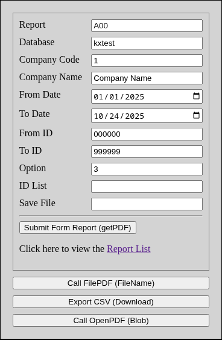
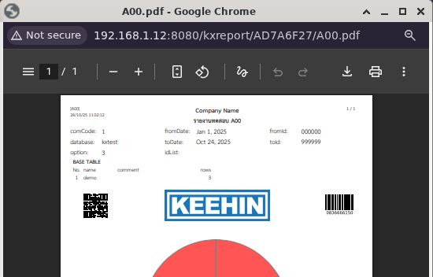

# KxReport


## 📘 Introduction

**KXReport** is a Spring Boot application designed as a dedicated **Report Generator Service** for the local **KEEHIN Application**. It specializes in generating dynamic reports using **JasperReports 7** and exposes this functionality via **RESTful API endpoints**.

---

## 🧩 Software Requirements

| Server       | Version |
| ------------ | ------- |
| Java Runtime | >= 17   |
| Tomcat       | >= 10   |
| MariaDB      | >= 10   |

---

| Developer    | Version |
| ------------ | ------- |
| Java JDK     | >= 17   |
| Git, Github  | 2.39.5  |
| Maven        | 3.8.7   |
| JasperReport | 7.x     |

---

## 🌐 Services on Server

The application is deployed as a WAR file (`kxreport.war`) and accessible at the following base URL:

```url
http://host:8080/kxreport
http://host:8080/kxreport/list.html
```

See all **parameters** and request demo from index.html<br>
<br>
<br>
See detail of report folder from list.html<br>
<br>

## ⚙️ API Endpoints

| Method   | Path       | Produces           | Description                                                                  |
| -------- | ---------- | ------------------ | ---------------------------------------------------------------------------- |
| **GET**  | `/json`    | `application/json` | Retrieves a list of all Jasper reports (`.jasper` files) details             |
| **GET**  | `/getPDF`  | `application/pdf`  | Generates JasperReport to PDF response, parameters in query requests.        |
| **POST** | `/openPDF` | `application/pdf`  | Generates JasperReport to PDF response, parameters in body request           |
| **POST** | `/filePDF` | `text/plain`       | Generates JasperReport to PDF file name response, parameters in body request |
| **POST** | `/fileCSV` | `text/plain`       | Generates JasperReport to CSV file name response, parameters in body request |

---

## 🛠️ Installation

### Clone repository

```bash
git clone https://github.com/swasin185/kxreport
cd kxreport
```

### ./script/install.sh

Software requirement on Server

```bash
#!/bin/bash
apt install default-jdk-headless git maven mariadb-server tomcat10
mysql < ./sql/init-db.sql
```

### ./script/build.sh

First time build all kxreport then update library and make report folder

```bash
#!/bin/bash
# Define directory variables
TOMCAT="tomcat10"
REPORT_DIR="/khgroup/report"
TOMCAT_LIB_DIR="/var/lib/${TOMCAT}/lib"
TOMCAT_WEBAPPS_DIR="/var/lib/${TOMCAT}/webapps"
TARGET_DIR="./target"
JASPER_SRC_DIR="${TARGET_DIR}/jasper"
KXREPORT_LIB_SRC_DIR="${TARGET_DIR}/kxreport/WEB-INF/lib"
WAR_SRC_PATH="${TARGET_DIR}/kxreport.war"

# --- Script Execution ---
export MAVEN_OPTS="-Djava.awt.headless=true"

echo "Running Maven clean and package..."
mvn clean package

echo "Setting up report directory: ${REPORT_DIR}"
sudo rm -r ${REPORT_DIR}/*.jasper
sudo rm -rf ${REPORT_DIR}/kxtest
sudo mkdir -p ${REPORT_DIR}
sudo cp -ur ${JASPER_SRC_DIR}/*/ ${REPORT_DIR}/
sudo find ${JASPER_SRC_DIR} -type f -name "*.jasper" -exec cp -ur -t /khgroup/report {} +


echo "Stop ${TOMCAT} service..."
sudo systemctl stop ${TOMCAT}

echo "Updating Tomcat libraries in: ${TOMCAT_LIB_DIR}"
sudo rm -rf ${TOMCAT_LIB_DIR}/*.jar
sudo cp -ur ${KXREPORT_LIB_SRC_DIR}/*.jar ${TOMCAT_LIB_DIR}

echo "Deploying WAR file to: ${TOMCAT_WEBAPPS_DIR}"
sudo cp ${WAR_SRC_PATH} ${TOMCAT_WEBAPPS_DIR}

sudo systemctl start ${TOMCAT}
echo "Start ${TOMCAT} service... [PRESS Q TO CLOSE]"
sudo systemctl status ${TOMCAT}
```

---

### Folder Structure

You should put \*.jasper file under ./report/
root of folder mean default app is ""
and support all database if not exists any report in sub database folder

```text
/khgroup/report/
|── app1/
|   |── database1/
|   |   └── *.jasper
|   |── database2/
|       └── *.jasper
|── app2/
|   |── database1/
|   |   └── *.jasper
|   |── database2/
|       └── *.jasper
|── *.jasper
```

---

## For Developer

### Jaspersoft Studio 7.0.3

Community Edition is recommended for developing and editing .jrxml templates.

```url
https://community.jaspersoft.com/download-jaspersoft/community-edition
```

Font Configuration: Ensure THSarabun font are configured (Thai Language):

- add THSarabun fonts in ./fonts/
- OR add classpath to ./src/main/webapps/WEB-INF/lib/jasperreports-fonts.jar

### deploy.sh

if you want to modify kxreport sources and update war file

```bash
#!/bin/bash
export MAVEN_OPTS="-Djava.awt.headless=true"
mvn package
sudo cp ./target/kxreport.war /var/lib/tomcat10/webapps
```

## Docker Script

Docker for evaluation or testing See ./script/docker/\*.sh.
Docker environment use the newer version of Java, Tomcat, MariaDB.
Update on late 2025 it support by Java v25, Tomcat v11, MariaDB v12

### docker.sh

```bash
#!/bin/bash
docker pull maven:3.9-eclipse-temurin-25-alpine
docker pull mariadb:12-noble
docker pull tomcat:11-jre25
./docker-stop.sh
./docker-mvn.sh
./docker-mariadb.sh
./docker-tomcat.sh
```

---

## SSL Host Service

```url
https://host:8443/kxreport
https://host:8443/kxreport/list.html
```

- Generate SSL certificate from ./script/cert/genkey.sh

```bash
cd ./script/cert
./genkey.sh
cd ../..
```

- You can should 2 ways to setup SSL Nginx or TomcatSSL

### Nginx (Reverse Proxy)

- Set Nginx to SSL 8443 reverse proxy to Tomcat http://localhost:8080/kxreport
  Nginx configuration file is in ./script/nginx/kxreport.conf

```bash
sudo apt install nginx

# Setup Nginx
sudo cp ./script/nginx/kxreport.conf /etc/nginx/sites-available/
sudo ln -s /etc/nginx/sites-available/kxreport.conf /etc/nginx/sites-enabled/
sudo systemctl restart nginx

# Block all external traffic to your backend ports
sudo ufw deny 8080/tcp
sudo ufw deny 3000/tcp

# Ensure only the NGINX port is open to the world
sudo ufw allow 8443/tcp
```

### Tomcat (SSL)

```bash
TOMCAT="tomcat10"
TOMCAT_LIB_DIR="/var/lib/${TOMCAT}/conf"
sudo cp ./script/cert/server.xml "${TOMCAT_LIB_DIR}/server.xml"
```

## application.properties

if you want to modify database connection user/password or report folder you can
edit ./src/main/resources/application.properties

```bash
logging.level.root = INFO
logging.file.name = /var/lib/tomcat10/logs/kxreport.log
logging.pattern.file = %d{yyyy-MM-dd HH:mm:ss} %-5level %msg%n
kxreport.report.path = /khgroup/report/
kxreport.db.uri = jdbc:mariadb://localhost:3306/
kxreport.db.config = ?user=kxreport&password=kxreport&minPoolSize=0&maxPoolSize=50&maxIdleTime=60
kxreport.db.config.ssl = ?user=kxreport&password=kxreport&minPoolSize=0&maxPoolSize=50&maxIdleTime=60&useSSL=true&requireSSL=false
```

- rebuild with ./script/build.sh
- OR put the modified application.properties in /var/lib/tomcat10/

---
