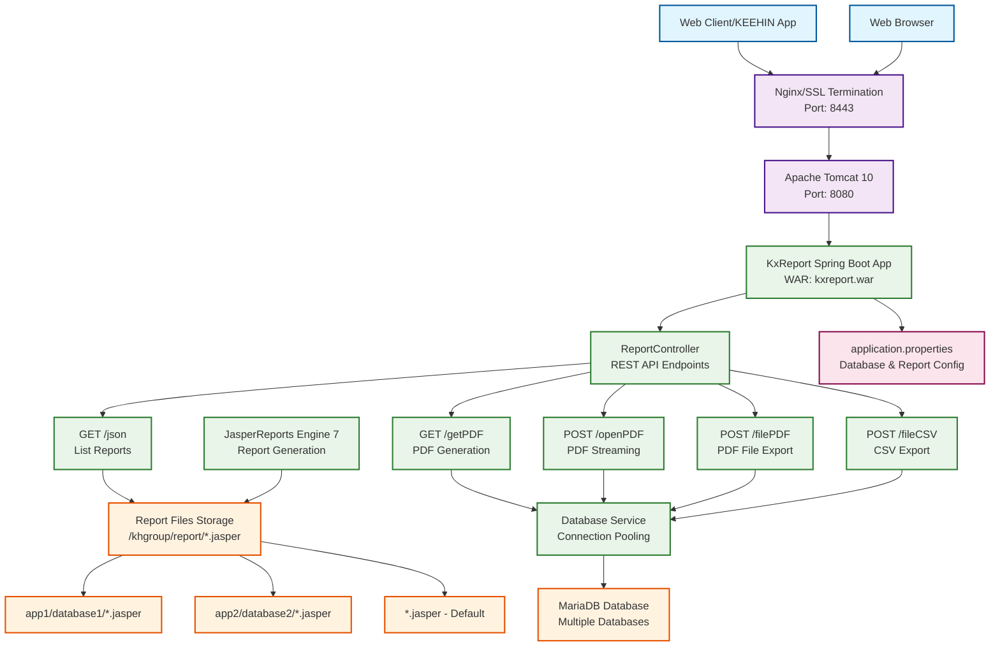

# KxReport System Architecture



## Architecture Components

### **Client Layer**
- **Web Client/KEEHIN App**: Main consumer application
- **Web Browser**: Direct access for testing and demo
- **Protocol**: HTTPS (Port 8443) with SSL termination

### **Load Balancer/Proxy Layer**
- **Nginx**: Reverse proxy and SSL termination
- **SSL Certificate**: Generated via `./script/cert/genkey.sh`
- **Port**: 8443 (HTTPS) → 8080 (HTTP to Tomcat)

### **Application Server Layer**
- **Apache Tomcat 10**: Servlet container
- **Deployment**: WAR file (`kxreport.war`)
- **Port**: 8080 (internal)

### **Application Layer**
- **Spring Boot 3.5.6**: Main application framework
- **Java 17**: Runtime environment
- **Packaging**: WAR for Tomcat deployment

### **Service Layer**
- **ReportController**: REST API endpoints
- **Database Service**: Connection pooling with MariaDB
- **JasperReports Engine 7**: Report generation engine

### **API Endpoints**
| Method | Path | Output | Description |
|--------|------|--------|-------------|
| GET | `/json` | JSON | List all available Jasper reports |
| GET | `/getPDF` | PDF | Generate PDF with query parameters |
| POST | `/openPDF` | PDF Stream | Stream PDF with body parameters |
| POST | `/filePDF` | Text | Export PDF to file |
| POST | `/fileCSV` | Text | Export CSV to file |

### **Data Layer**
- **MariaDB**: Multi-database support
- **Connection Pooling**: Configurable pool sizes (0-99 connections)
- **Report Storage**: File system based (`/khgroup/report/`)

### **Report File Structure**
```
/khgroup/report/
├── app1/
│   ├── database1/
│   │   └── *.jasper
│   └── database2/
│       └── *.jasper
├── app2/
│   ├── database1/
│   └── database2/
└── *.jasper (default)
```

### **Configuration**
- **application.properties**: Database and report path configuration
- **Environment variables**: Runtime configuration
- **Logging**: SLF4J with file logging to `/var/lib/tomcat10/logs/kxreport.log`

## Data Flow

1. **Request Flow**: Client → Nginx → Tomcat → Spring Boot → Controller
2. **Report Generation**: Controller → JasperReports → Report Files → Output
3. **Database Access**: Controller → Database Service → MariaDB Connection Pool
4. **File Operations**: Report Engine → File System → PDF/CSV Output

## Security & Performance

- **SSL/TLS**: HTTPS encryption via Nginx
- **Connection Pooling**: Database connection optimization
- **Headless Mode**: `MAVEN_OPTS=-Djava.awt.headless=true` for server deployment
- **Logging**: Structured logging with timestamps and levels
