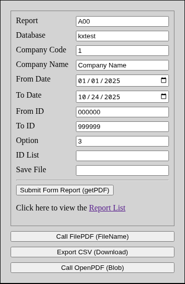
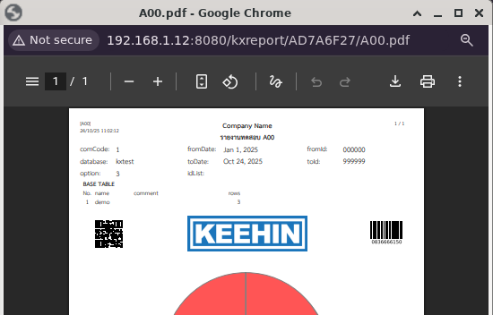
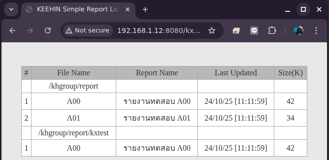

# 🧾 KXReport


## 📘 Introduction

**KXReport** is a Spring Boot application designed as a dedicated **Report Generator Service** for the local **KEEHIN Application**.  
It specializes in generating dynamic reports using **JasperReports7** and exposes this functionality via **RESTful API endpoints**.

---

## 🧩 Software Requirements

| Server       | Version |
| ------------ | ------- |
| Java Runtime | >= 17   |
| Tomcat       | >= 10   |
| MariaDB      | >= 10   |

---

| Developer    | Version |
| ------------ | ------- |
| Java JDK     | >= 17   |
| VSCode       | 1.105.1 |
| Git, Github  | 2.39.5  |
| Maven        | 3.8.7   |
| JasperReport | 7.x     |

---

## 🌐 Services on Server

The application is deployed as a WAR file (`kxreport.war`) and accessible at the following base URL:

```url
http://host:8080/kxreport
```

See all **parameters** and request demo from index.html


See detail of report folder from list.html


## ⚙️ API Endpoints

| Method   | Path       | Produces           | Description                                                                  |
| -------- | ---------- | ------------------ | ---------------------------------------------------------------------------- |
| **GET**  | `/json`    | `application/json` | Retrieves a list of all Jasper reports (`.jasper` files) details             |
| **GET**  | `/getPDF`  | `application/pdf`  | Generates JasperReport to PDF response, parameters in query requests.        |
| **POST** | `/openPDF` | `application/pdf`  | Generates JasperReport to PDF response, parameters in body request           |
| **POST** | `/filePDF` | `text/plain`       | Generates JasperReport to PDF file name response, parameters in body request |
| **POST** | `/fileCSV` | `text/plain`       | Generates JasperReport to CSV file name response, parameters in body request |

---

## 🛠️ Installation

### install.sh

Software requirement on Server

```bash
#!/bin/bash
apt install default-jdk-headless git maven mariadb-server tomcat10
git clone https://github.com/swasin185/kxreport
cd kxreport
mysql < ./sql/init-db.sql
```

### build.sh

First time build all kxreport then update library and make report folder

```bash
#!/bin/bash
# Define directory variables
TOMCAT="tomcat10"
REPORT_DIR="/khgroup/report"
TOMCAT_LIB_DIR="/var/lib/${TOMCAT}/lib"
TOMCAT_WEBAPPS_DIR="/var/lib/${TOMCAT}/webapps"
TARGET_DIR="./target" # Assuming the script runs from the project root
JASPER_SRC_DIR="${TARGET_DIR}/jasper"
KXREPORT_LIB_SRC_DIR="${TARGET_DIR}/kxreport/WEB-INF/lib"
WAR_SRC_PATH="${TARGET_DIR}/kxreport.war"

# --- Script Execution ---
export MAVEN_OPTS="-Djava.awt.headless=true"

echo "Running Maven clean and package..."
mvn clean package

echo "Setting up report directory: ${REPORT_DIR}"
sudo rm -rf "${REPORT_DIR}"
sudo mkdir -p "${REPORT_DIR}"
sudo cp -ur "${JASPER_SRC_DIR}"/* "${REPORT_DIR}/"
echo "Stop ${TOMCAT} service..."
sudo systemctl stop ${TOMCAT}

echo "Updating Tomcat libraries in: ${TOMCAT_LIB_DIR}"
sudo rm -rf "${TOMCAT_LIB_DIR}"/*.jar
sudo cp -ur "${KXREPORT_LIB_SRC_DIR}"/*.jar "${TOMCAT_LIB_DIR}"

echo "Deploying WAR file to: ${TOMCAT_WEBAPPS_DIR}"
sudo cp "${WAR_SRC_PATH}" "${TOMCAT_WEBAPPS_DIR}"

sudo systemctl start ${TOMCAT}
echo "Start ${TOMCAT} service... [PRESS Q TO CLOSE]"
sudo systemctl status ${TOMCAT}
```

## Jasper Files Folder

You should save Jasper Report Sources (\*.jrxml) in your report project.
Just deploy compiled version (\*.jasper) to this folder

```bash
cp -ur *.jasper /khgroup/report
```

### Folder Structure

```
/khgroup/report/
├── app/
│   ├── database/
│   │   └── \*.jasper
│   └── database/
│       └── \*.jasper
├── app/
│   ├── database/
│   │   └── \*.jasper
│   └── database/
│       └── \*.jasper
└── \*.jasper
```

## For Developer

### Jaspersoft Studio 7.0.3

Community Edition is recommended for developing and editing .jrxml templates.

```url
https://community.jaspersoft.com/download-jaspersoft/community-edition
```

Font Configuration: Ensure THSarabun fonts are configured:

-   add THSarabun fonts in ./fonts/
-   OR add classpath to ./src/main/webapps/WEB-INF/lib/jasperreports-fonts.jar

### deploy.sh

if you want to modify kxreport sources and update war file

```bash
#!/bin/bash
export MAVEN_OPTS="-Djava.awt.headless=true"
mvn package
sudo cp ./target/kxreport.war /var/lib/tomcat10/webapps
```

## Docker Scripts

If you prefer to use docker for evaluation or testing See. ./docker/\*.sh
in docker environment use the latest version of Java, Tomcat, MariaDB

### docker.sh

```bash
#!/bin/bash
docker pull maven:3.9-eclipse-temurin-25-alpine
docker pull mariadb:12-noble
docker pull tomcat:11-jre25
./docker-stop.sh
./docker-mvn.sh
./docker-mariadb.sh
./docker-tomcat.sh
```
